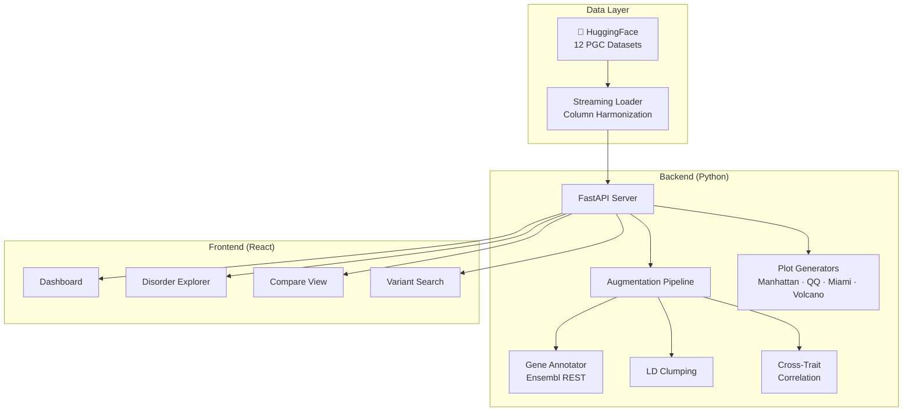

<div align="center">

```
 ██████╗  ██████╗  ██████╗     █████╗ ████████╗██╗      █████╗ ███████╗
 ██╔══██╗██╔════╝ ██╔════╝    ██╔══██╗╚══██╔══╝██║     ██╔══██╗██╔════╝
 ██████╔╝██║  ███╗██║         ███████║   ██║   ██║     ███████║███████╗
 ██╔═══╝ ██║   ██║██║         ██╔══██║   ██║   ██║     ██╔══██║╚════██║
 ██║     ╚██████╔╝╚██████╗    ██║  ██║   ██║   ███████╗██║  ██║███████║
 ╚═╝      ╚═════╝  ╚═════╝    ╚═╝  ╚═╝   ╚═╝   ╚══════╝╚═╝  ╚═╝╚══════╝
```

**Interactive Visual Explorer for Psychiatric Genomics Consortium GWAS Data**

[](https://python.org)
[](https://typescriptlang.org)
[](https://fastapi.tiangolo.com)
[](https://react.dev)
[](https://huggingface.co/collections/OpenMed/pgc-psychiatric-gwas-summary-statistics)
[](LICENSE)

[Live Demo](#) · [Documentation](#api-reference) · [Notebooks](notebooks/) · [HuggingFace Collection](https://huggingface.co/collections/OpenMed/pgc-psychiatric-gwas-summary-statistics)

</div>

---

## 🧬 Overview

PGC Atlas is a full-stack interactive platform for exploring **~1 billion rows** of genome-wide association study (GWAS) summary statistics from the [Psychiatric Genomics Consortium](https://pgc.unc.edu), hosted on HuggingFace by [OpenMed](https://huggingface.co/OpenMed).

| Disorder | Variants | Key Stat |
|:---------|:---------|:---------|
| 🔴 **ADHD** | 31.2M | 27 GW-significant loci |
| 🟡 **Anxiety** | 27.5M | 12 GW-significant loci |
| 🟢 **Autism** | 18.6M | 5 GW-significant loci |
| 🟣 **Bipolar** | 74.4M | 64 GW-significant loci |
| ⚪ **Cross-disorder** | 63.3M | 109 pleiotropic loci |
| 🩷 **Eating Disorders** | 10.6M | 8 GW-significant loci |
| 🔵 **Depression (MDD)** | 179M | 243 GW-significant loci |
| 🟠 **OCD/Tourette** | 36.5M | 4 GW-significant loci |
| ⚫ **Other** | 40.9M | Misc. phenotypes |
| 🔴 **PTSD** | 128M | 15 GW-significant loci |
| 💚 **Schizophrenia** | 91.4M | 287 GW-significant loci |
| 💜 **Substance Use** | 214M | 44 GW-significant loci |

## 🏗️ Architecture



## 📊 Visualizations

### Manhattan Plot
Genome-wide view of association signals across all 22 autosomes. Variants exceeding genome-wide significance (p < 5×10⁻⁸) are highlighted in red.

### QQ Plot
Quantile-quantile plot with genomic inflation factor (λ_GC) to assess systematic bias and true signal enrichment.

### Miami Plot
Bidirectional Manhattan comparing two disorders side-by-side. Top panel shows one disorder, bottom (inverted) shows the other. Shared loci appear at the same genomic position.

### Cross-Trait Heatmap
Genetic correlation matrix showing effect-size concordance between all 12 disorder pairs.

## 🚀 Quick Start

### Option 1: Dashboard Only (with mock data)

```bash
cd dashboard
npm install
npm run dev
# Open http://localhost:5173
```

### Option 2: Full Stack

```bash
# Backend
pip install -e .
uvicorn api.app:app --reload --port 8000

# Frontend (in another terminal)
cd dashboard
npm install
VITE_API_URL=http://localhost:8000 npm run dev
```

### Option 3: Docker

```bash
docker compose up
# Dashboard: http://localhost:5173
# API docs:  http://localhost:8000/api/docs
```

### Option 4: Python Package

```python
from pgc_explorer.data_loader import PGCDataLoader
from pgc_explorer.manhattan import prepare_manhattan_data

loader = PGCDataLoader()
df = loader.load_top_hits("schizophrenia", n=50000)
plot_data = prepare_manhattan_data(df)
```

## 📁 Repository Structure

```
pgc-atlas/
├── pgc_explorer/              # Python analysis package
│   ├── config.py              # Dataset registry & constants
│   ├── data_loader.py         # HF streaming + harmonization
│   ├── pipeline.py            # Data augmentation pipeline
│   ├── gene_annotator.py      # Ensembl REST gene annotation
│   ├── ld_scores.py           # LD clumping utilities
│   ├── cross_trait.py         # Cross-disorder correlation
│   ├── manhattan.py           # Manhattan plot generation
│   ├── qq_plot.py             # QQ plot generation
│   ├── miami.py               # Miami plot generation
│   ├── volcano.py             # Volcano plot generation
│   └── export.py              # Multi-format export
├── api/                       # FastAPI REST API
│   ├── app.py                 # Application entry point
│   ├── models.py              # Pydantic schemas
│   └── routes/                # Endpoint modules
├── dashboard/                 # React + Vite + Tailwind frontend
│   └── src/
│       ├── components/        # Reusable UI components
│       ├── pages/             # Route pages
│       ├── hooks/             # React Query hooks
│       └── api/               # API client + mock data
├── notebooks/                 # Jupyter analysis notebooks
├── docker-compose.yml
├── Dockerfile
└── Makefile
```

## 🔌 API Reference

| Endpoint | Method | Description |
|:---------|:-------|:------------|
| `/api/datasets` | GET | List all 12 disorders with metadata |
| `/api/datasets/{disorder}` | GET | Get disorder details and subsets |
| `/api/variants/search?snp=rs1234` | GET | Search variant across datasets |
| `/api/variants/region?chr=6&start=..&end=..` | GET | Query genomic region |
| `/api/plots/manhattan/{disorder}` | GET | Manhattan plot data (Plotly JSON) |
| `/api/plots/qq/{disorder}` | GET | QQ plot data |
| `/api/plots/miami?disorder1=..&disorder2=..` | GET | Miami plot comparing two disorders |
| `/api/plots/volcano/{disorder}` | GET | Volcano plot data |
| `/api/stats/overview` | GET | Collection-level summary |
| `/api/export` | POST | Export filtered data (CSV/TSV/JSON/Parquet/BED) |

## 📓 Notebooks

| Notebook | Description |
|:---------|:------------|
| [01_quick_start.ipynb](notebooks/01_quick_start.ipynb) | Loading and exploring PGC data |
| [02_manhattan_plots.ipynb](notebooks/02_manhattan_plots.ipynb) | Creating publication-ready Manhattan plots |
| [03_cross_disorder.ipynb](notebooks/03_cross_disorder.ipynb) | Cross-disorder genetic correlation analysis |
| [04_data_export.ipynb](notebooks/04_data_export.ipynb) | Filtering and exporting data |

## 🏷️ Data Source & Citation

Summary statistics are from the **Psychiatric Genomics Consortium (PGC)**, hosted on HuggingFace by **OpenMed** under CC-BY-4.0:

> https://huggingface.co/collections/OpenMed/pgc-psychiatric-gwas-summary-statistics

If you use this tool in your research, please cite the relevant PGC publications and the OpenMed dataset collection.

## 🤝 Contributing

See [CONTRIBUTING.md](CONTRIBUTING.md) for guidelines. We welcome:
- Bug reports and feature requests
- New visualizations and analysis modules
- Documentation improvements
- Performance optimizations for large datasets

## 📄 License

Data: [CC-BY-4.0](https://creativecommons.org/licenses/by/4.0/) (PGC/OpenMed)
Code: [MIT](LICENSE)
